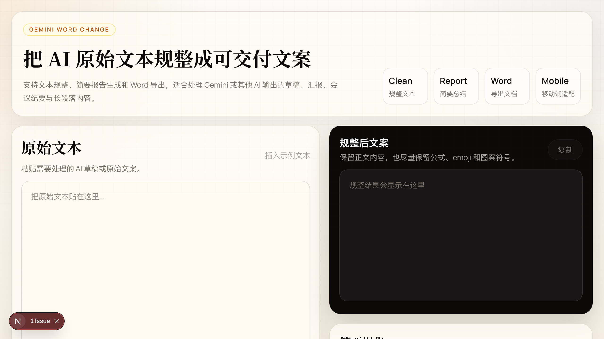

# Gemini Word Change

把 AI 原始文本快速规整成可交付文案，并补上简要总结与 Word 导出。



## 项目定位

这是一个适合手机和电脑一起使用的轻量 Web App，面向下面这类场景：

- 整理 Gemini、ChatGPT 或其他 AI 生成的原始草稿
- 把杂乱段落、符号和换行清洗成更适合交付的文案
- 生成简要报告，方便汇报、归档和继续编辑
- 一键导出为 `.docx` 文档

## 核心功能

- 文本规整：去掉多余空格、Markdown 痕迹、装饰符号和杂乱换行
- 简要报告：输出主题、核心要点、结论和建议
- Word 导出：生成 `.docx` 文件，适合交付与存档
- 双模式运行：有 `OPENAI_API_KEY` 时优先使用 AI 生成报告，没有时走本地兜底逻辑
- 移动端适配：手机和电脑都能直接使用

## 本地启动

```bash
npm install
npm run dev
```

浏览器打开：

```bash
http://localhost:3000
```

## 环境变量

在项目根目录创建 `.env.local`：

```bash
OPENAI_API_KEY=your_api_key
```

不配置也可以正常使用，只是报告会采用本地规则生成。

## 手机访问

如果手机和电脑在同一 Wi-Fi 下，可以先查到你电脑的局域网 IP，然后在手机浏览器打开：

```bash
http://你的局域网IP:3000
```

如果你需要让同一局域网设备访问开发服务器，可以用：

```bash
npm run dev -- --hostname 0.0.0.0
```

## 技术栈

- Next.js App Router
- React
- Tailwind CSS
- OpenAI API
- docx

## 主要文件

- `app/page.tsx`：主页面与交互
- `app/api/clean/route.ts`：文案规整接口
- `app/api/report/route.ts`：报告生成接口
- `app/api/export/route.ts`：Word 导出接口
- `lib/normalize.ts`：文本清洗逻辑
- `lib/report.ts`：报告生成逻辑
- `lib/docx.ts`：Word 文档构建逻辑
